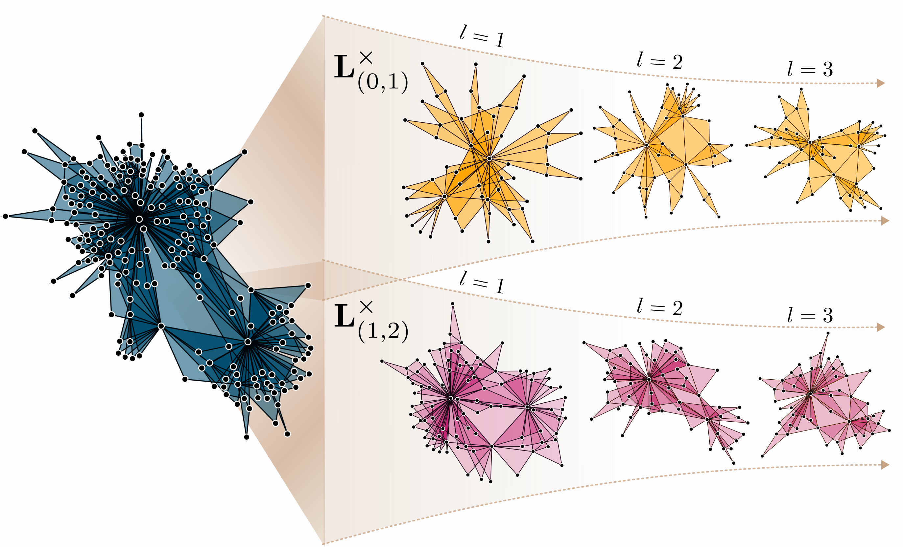

# Higher-order Laplacian Renormalization

Code implementation for the paper *Nurisso, M., Morandini, M., Lucas, M., Vaccarino, F., Gili, T., & Petri, G. (2024). Higher-order Laplacian Renormalization. arXiv preprint [arXiv:2401.11298](
https://doi.org/10.48550/arXiv.2401.11298
).*

## Contents
- ``Scripts``
  - ``plotting.py``: functions to plot 2-dimensional simplicial complexes;
  - ``renormalize.py``: functions to compute the entropic susceptibility and renormalize simplicial complexes;
  - ``scomplex.py``: functions to work with simplicial complexes, generate them and compute their cross-order Laplacians.
- ``Notebooks``: jupyter notebooks for reproducing the paper's figures.
- ``Data``: datasets and pre-computed entropic susceptibility curves.

The code was tested for Python 3.11 and the dependencies specified in [requirements.txt](requirements.txt).
